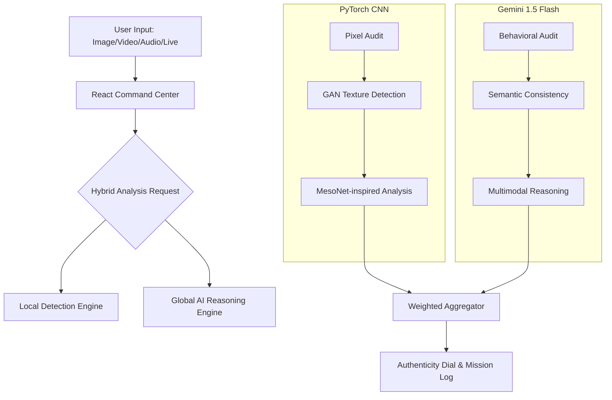

# OmniCheck 11-11: Technical Architecture & Working Process

OmniCheck 11-11 is a state-of-the-art, multimodal deepfake detection platform. This document outlines the technology stack, system architecture, and the hybrid detection logic that powers the "Command Center."

## 1. Technology Stack

### Frontend (User Interface)
- **Framework**: React + Vite (Fast, optimized builds).
- **Styling**: Tailwind CSS + Vanilla CSS (Custom Glassmorphism HUD).
- **Animations**: Framer Motion (Smooth layout transitions and glowing effects).
- **Icons**: Lucide React (Standardized security-themed iconography).
- **Communication**: Fetch API (Real-time neural link to Backend).

### Backend (Deep Analysis Engine)
- **Framework**: FastAPI (High-performance Python web framework).
- **Inference**: PyTorch (Custom-trained local CNN).
- **AI Reasoning**: Google Gemini 1.5 Flash (Multimodal high-level audit).
- **Media Processing**: 
  - **OpenCV**: Video frame extraction and pixel manipulation.
  - **Librosa**: Spectral audio feature extraction and GAN-noise detection.
- **Environment**: Python Dotenv (Secure API key management).

---

## 2. System Architecture

The system follows a **Hybrid Analysis Model**, combining deterministic local machine learning with contextual AI reasoning.

---

## 3. The Working Process

### Step 1: Data Infiltration (Input)
The user selects a mission module (Upload, Live Camera, DeepCall, or Social Watch). The frontend captures the media and establishes an encrypted "Neural Link" to the FastAPI backend.

### Step 2: Local Modal Processing (Pixel-Level)
The **Custom PyTorch CNN** audits the raw data at the binary level. It looks for "checkerboard artifacts" and noise patterns that are unique to AI-generated content (GANs or Diffusion models). This provides a fast, technical baseline.

### Step 3: Global AI Reasoning (Semantic-Level)
Simultaneously, the media is sent to **Gemini 1.5 Flash**. Unlike the local model, Gemini looks at *human* elements:
- **Blinking Patterns**: Are they natural?
- **Lighting Inconsistency**: Does the light on the skin match the background?
- **Lip-Sync Accuracy**: Do the spectral audio peaks align with mouth movements?

### Step 4: Hybrid Scoring (The Aggregator)
The system aggregates the results using a weighted formula:
- **40% Weight**: Local Hub (Technical/Pixel data).
- **60% Weight**: AI Reasoning (Contextual/Behavioral data).

The result is a final **Authenticity Score** (0-100%) and a detailed **Mission Log** explaining the decision.

---

## 4. Key Security Features
- **Liveness Sentinel**: Real-time webcam auditing to prevent "replay" attacks.
- **Spectral Pulse Audit**: Detects robotic cloning artifacts in audio streams.
- **Metadata Intercept**: Scans social media links for compression anomalies often hidden by deepfake tools.

---
*OmniCheck 11-11 // Built for Mission-Critical Authenticity*
